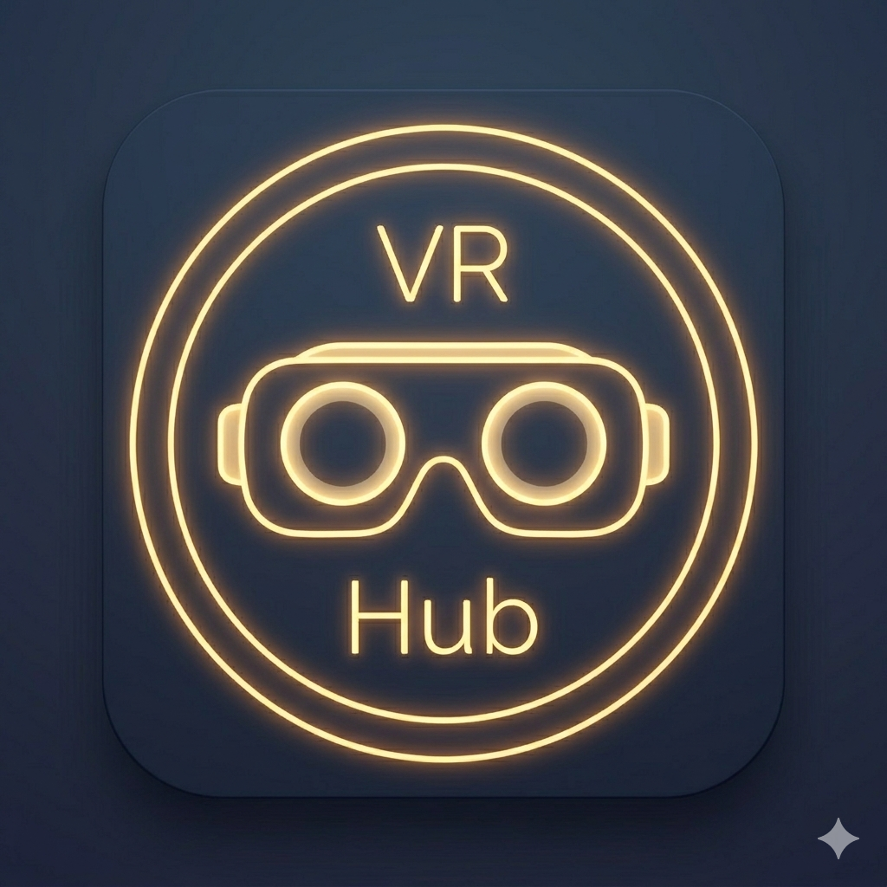

# VRHub

<p align="center">
  
  <br>
  
  
  
</p>

<p align="center">
  <strong>A Solstice Project</strong>
</p>

A standalone Meta Quest application to browse, download, and install VR games natively, built with **Kotlin** and **Jetpack Compose**.

---

### Table of Contents
- [Overview](#overview)
- [Key Features](#key-features)
- [Download & Installation](#download--installation)
- [Server Configuration](#server-configuration)
- [Build & Development Commands](#build--development-commands)
- [Contributing](#contributing)

---

## Overview

VRHub is a personal VR game manager for Meta Quest headsets. Connect to your **private server** to browse your own game catalog and install titles directly — no manual sideloading required. Your library, organized and at your fingertips.

**This app does not host or provide any games. You must only install games you have legitimately purchased.** VRHub is designed solely for managing your personal collection on your own server. We do not condone piracy in any form.

---

## Key Features

- **Standalone Sideloading**: Install games (APK + OBB) directly on your Meta Quest.
- **Custom Server Configuration**: Connect to any compatible server via JSON URL or manual key-value pairs.
- **Background Downloads**: Optimized to continue downloading even when the device sleeps.
- **Offline Mode**: Browse cached catalog and queued installations when offline.
- **Optimized Performance**: Smooth navigation through large game catalogs.

---

## Download & Installation

[](https://github.com/LeGeRyChEeSe/VRHub/releases/latest)

> [!IMPORTANT]
> Requires Meta Quest with **Developer Mode** enabled. Enable it at [meta.com/quest/developers](https://meta.com/quest/developers/).

### Method 1: SideQuest (Recommended)
The easiest way to install APKs on Quest.

1. Download and install [SideQuest](https://sidequestvr.com/) on your PC/Mac
2. Connect your Quest headset via USB or Wi-Fi
3. Download the latest APK: [](https://github.com/LeGeRyChEeSe/VRHub/releases/latest)
4. Drag and drop the APK onto SideQuest — installation is automatic

### Method 2: Direct Browser Install
Install directly from your Quest without a PC (Quest Browser required).

1. On your Quest headset, open the **Meta Quest Browser**
2. Download the APK: [](https://github.com/LeGeRyChEeSe/VRHub/releases/latest)
3. Open the downloaded file — the system APK installer will handle the rest

### Method 3: adb (Developer)
For advanced users comfortable with command-line tools.

1. Download the APK: [](https://github.com/LeGeRyChEeSe/VRHub/releases/latest)
2. Connect Quest via USB and enable USB debugging
3. Run: `adb install -r VRHub-vX.X.X.apk`

---

## Server Configuration

After installing VRHub, you need to connect it to your personal game server. You will receive a file or text containing two pieces of information: an address and a password.

It looks something like this:
```
{
  "baseUri": "https://your-server.com/games/",
  "password": "your-password-here"
}
```

### Option 1: You have the address and password as text

Select **Manual Entry** mode, then:

1. In the **Key** field (left), type exactly: `baseUri`
2. In the **Value** field (right), type the address you were given (e.g., `https://your-server.com/games/`)
3. Press **ADD KEY**
4. Repeat: in **Key** type `password`
5. In **Value** type the password you were given
6. Press **ADD KEY**
7. Press the **TEST** button (it becomes clickable once both keys are added) and wait for the confirmation
8. Press **SAVE**

### Option 2: You have a link to a configuration file

If someone gave you a link (like `https://example.com/config.json`), select **JSON URL** mode and paste that link. VRHub will download and use the configuration automatically.

### Testing Your Configuration

Use the **TEST** button to validate your configuration before saving. VRHub will check the server connection and verify the configuration structure.

> [!IMPORTANT]
> VRHub is a personal catalog manager. The app does not provide or host any game content. You are solely responsible for the server you configure and must only use it to manage games you have legitimately purchased.

---

## Build & Development Commands

### Prerequisites
- **Android Studio** (Ladybug or newer).
- **Android SDK 34** (API 34).

### Building the Project
```bash
# Clean the project
gradlew.bat clean
# or
make clean

# Build debug APK
gradlew.bat assembleDebug
# or
make build

# Build release APK (requires keystore.properties)
gradlew.bat assembleRelease
# or
make release
```

### CI/CD & Local Validation
This project uses GitHub Actions for PR validation. You can run the validation logic locally to catch issues before pushing:

- **Linux/macOS:** `./scripts/test-ci-config.sh`

For end-to-end tests including release candidate builds:
- **Linux/macOS:** `./scripts/test-rc-e2e.sh`

### Version Management
This project follows **[Semantic Versioning (SemVer)](https://semver.org/)**.

When building from the command line, you can specify the version using Gradle properties:
- `versionCode`: A positive integer (e.g., `-PversionCode=15`)
- `versionName`: A SemVer compatible string (e.g., `-PversionName=2.5.0` or `-PversionName=2.5.0-rc.1`)

The `versionName` must match the format `X.Y.Z` with optional pre-release suffixes or build metadata:
- Basic: `2.5.0`
- Pre-release: `2.5.0-rc`, `2.5.0-beta.1`, `2.5.0-alpha`
- Build metadata: `2.5.0+build.1`
- Combined: `2.5.0-rc.1+build.1`

The regex pattern used is: `^[0-9]+\.[0-9]+\.[0-9]+(-[a-zA-Z0-9.]+)?(\+[a-zA-Z0-9.]+)?$`

### Secure Update Authentication
To enable application update checks, a secret key is required for request signing.
- **Environment Variable:** `VRHUB_UPDATE_SECRET`
- **Local Development:** You can provide this in your `local.properties` file or as a Gradle property:
  ```properties
  VRHUB_UPDATE_SECRET=your_secret_here
  ```
- **Release Builds:** For security, release builds will fail if this secret is not provided via the environment variable or `keystore.properties`.

---

## Contributing

We welcome contributions! To maintain a clean project history, we strictly follow the **[Conventional Commits](https://www.conventionalcommits.org/)** specification.

### Naming Convention
All commit messages and pull requests should use the following prefixes:
- `feat:` for new features.
- `fix:` for bug fixes.
- `docs:` for documentation changes.
- `style:` for formatting or UI adjustments (no logic changes).
- `refactor:` for code changes that neither fix a bug nor add a feature.
- `perf:` for performance improvements.
- `chore:` for maintenance tasks.

### Share Ideas & Report Bugs
If you have an idea for a new feature or have found a bug, please open an issue:
- [Report a Bug](https://github.com/LeGeRyChEeSe/VRHub/issues/new?template=bug_report.md)
- [Suggest a Feature](https://github.com/LeGeRyChEeSe/VRHub/issues/new?template=feature_request.md)
- [Ask a Question or Give Feedback](https://github.com/LeGeRyChEeSe/VRHub/issues/new?template=question.md)

### Submit a Pull Request
1. Fork the repository.
2. Create a new branch (`feat/your-feature` or `fix/your-fix`).
3. Commit your changes following the naming convention.
4. Submit a pull request with a clear description of your changes.